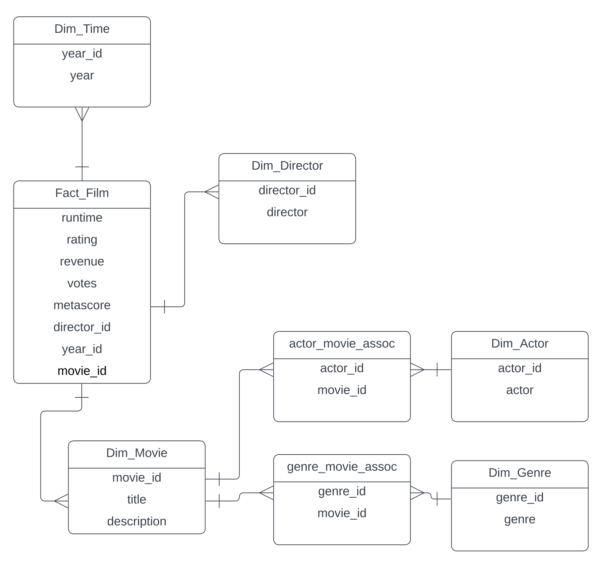

# star_schema_warehouse_sql

This repository contains SQL scripts to create a star schema data warehouse for a movie dataset using SQL Server. The star schema design aims to provide a structured and optimized way to analyze and query movie-related data. This is because star schema design optimizes for querying the data instead of for inserting and updating. The use case here is that this movie data will be used to gather information, make reports and dashboards, and will not be frequently updated. 

## Table of Contents

- [Introduction](#introduction)
- [Data Model](#data-model)
- [SQL Files](#sql-files)

## Introduction 

The Movie Data Warehouse project focuses on creating a star schema for efficient querying and analysis of a movie dataset. The star schema design consists of fact and dimension tables that simplify complex queries and provide a foundation for data analysis. This repository includes SQL scripts to set up the data warehouse in SQL Server.

## Data Model 

- **Fact Table:** `fact_film`
  - Contains movie-related metrics and measures such as runtime, rating, revenue, votes, metascore, etc.
  - Foreign keys to connect with dimension tables.

- **Dimension Tables:**
  - `dim_actor`
  - `dim_director`
  - `dim_genre`
  - `dim_movie`
  - `dim_year`:

- **Mapping Tables:**
  - `map_actor`
  - `map_director`
  - `map_genre`
  - `map_film`
  - `map_year`

- **Staging Tables:**
  - `stg_actor`
  - `stg_genre`
  - `stg_film`
  - `stg_actor_film_assoc`
  - `stg_genre_film_assoc`

- **Landing Table:**
  - `land_movies`: Landing table containing raw movie data.

## SQL Files 

This repository contains several SQL script files that are used to create and populate the tables in the star schema data warehouse. Each script file serves a specific purpose in setting up the data warehouse structure and importing data.

### Staging and Mapping Tables

- `1_stg_map_film.sql`: This script file creates the staging and mapping tables related to films. It facilitates the initial loading and transformation of film data.

- `2_creating_populating_actors_staging_mapping_tables.sql`: This script file sets up the staging and mapping tables for actor-film associations. It helps establish relationships between actors and films.

- `3_stg_map_genre_assoc.sql`: Here, you'll find the script for creating staging and mapping tables related to genre-film associations. This step is essential for linking genres and films.

### Dimension Tables

- `4_dim_tables.sql`: This script file focuses on the creation of dimension tables. Dimension tables hold valuable information about actors, directors, genres, movies, and years.

### Overall Database Setup

- `script_star_schema_movie_db.sql`: This script is the combination of the previous scripts compiled into one. 

These script files work together to establish the structure of the data warehouse and populate it with data. By executing these scripts in the correct order, you can set up a functional and efficient environment for querying and analyzing movie-related data.

The dataset being used: https://www.kaggle.com/datasets/PromptCloudHQ/imdb-data

